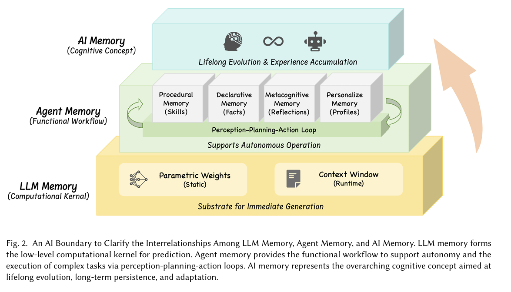
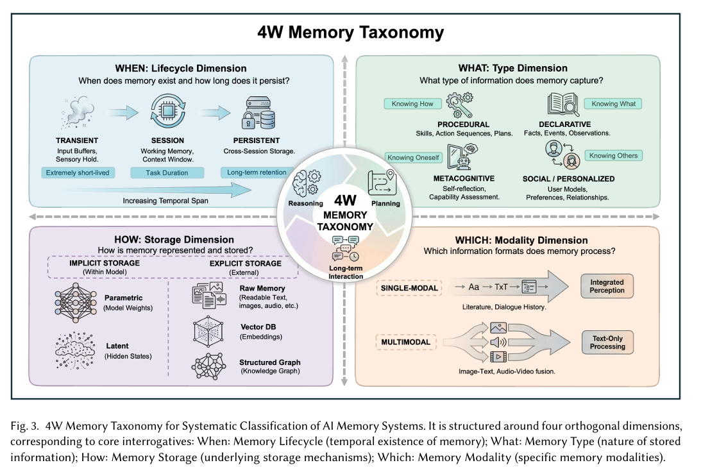
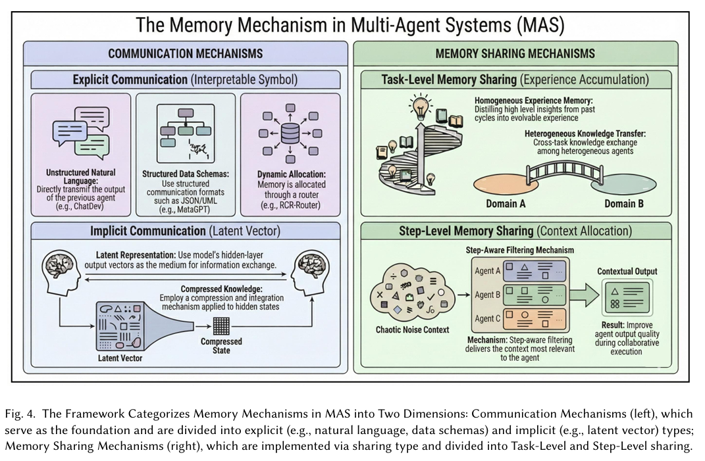

  <h1>Survey on AI Memory: Theories, Taxonomies, Evaluations, and Emerging Trends</h1>

  

    
    
    
    
  

  
  
<em>Fig. 1. The Evolutionary Landscape of AI Memory: A Content Roadmap of the Survey.</em>

---

## 📢 News
* **[2026/01/15]** 🚀 Full survey released! We establish a unified framework for AI memory mechanisms.
* **[2026/01/07]** 🚀 Project repository initialized.

---

## 🌟 Introduction

This survey presents a comprehensive overview of AI memory
mechanisms anchored in a unified theoretical framework. We propose a structured "4W Memory Taxonomy" to enable consistent
analysis across diverse architectures. Building on this foundation, we systematically review memory systems in both single- and
multi-agent contexts, examining their architectures, functions, applications, and evaluation methodologies. By synthesizing cognitive
theories with engineering benchmarks, this work provides a coherent roadmap for advancing the theoretical understanding and
technological development of AI memory. 

### 🧩 Conceptual Boundaries
To clarify the scope of AI memory, we distinguish between three interrelated layers:
* **LLM Memory**: The low-level computational kernel for prediction, consisting of **Parametric Weights** (static) and **Context Window** (runtime).
* **Agent Memory**: The functional workflow supporting autonomous operation and complex task execution via perception-planning-action loops.
* **AI Memory**: The overarching cognitive concept aimed at lifelong evolution, long-term persistence, and adaptation.

  
  
<em>Fig. 2. An AI Boundary to Clarify the Interrelationships Among LLM Memory, Agent Memory, and AI Memory.</em>

---

## 🛠 The 4W Memory Taxonomy

We establish a structured **4W Memory Taxonomy** to enable consistent analysis across diverse architectures:

* **When (Lifecycle Dimension)**: Examines the temporal span of memory, including **Transient** (extremely short-lived), **Session** (task duration), and **Persistent** (cross-session retention).
* **What (Type Dimension)**: Categorizes by the nature of stored information, including **Procedural** (skills), **Declarative** (facts), **Metacognitive** (reflections), and **Social/Personalized** (user models).
* **How (Storage Dimension)**: Explores technical implementation, from **Implicit Storage** (Parametric/Latent) within model weights to **Explicit Storage** (Raw Text, Vector DB, or Structured Graphs) outside the model.
* **Which (Modality Dimension)**: Classifies by information formats, covering **Single-modal** (text-only) and **Multimodal** (fusing images, audio, and video).

  
  
<em>Fig. 3. 4W Memory Taxonomy for Systematic Classification of AI Memory Systems.</em>

---

## 🏗 Memory in Multi-Agent Systems (MAS)

Effective collaboration within MAS hinges on communication mediated by memory sharing. We organize these mechanisms into two core dimensions:

* **Communication Mechanisms**: Ranges from **Explicit Communication** (interpretable symbols like natural language or structured schemas) to **Implicit Communication** (latent representations/hidden embeddings).
* **Memory Sharing Mechanisms**: Categorized into **Task-Level** (experience accumulation and knowledge transfer) and **Step-Level** (precise context allocation and role-aware filtering).

  
  
<em>Fig. 4. Framework Categorizing Memory Mechanisms in MAS into Communication Mechanisms and Memory Sharing Mechanisms.</em>

---

## 📊 Evaluation Taxonomy

We categorize memory evaluation into four essential dimensions to provide a structured assessment of agent memory:

| Dimension | Description | Representative Metrics |
| :--- | :--- | :--- |
| **Retrieval Capability** | Evaluates the ability to fetch relevant memory segments. | Recall@k, Precision@k, NDCG@k  |
| **Updating Capability** | Measures the ability to correctly modify, write, and forget information. | Update Accuracy, Hallucination Rate, F1-score  |
| **Cognitive Capability** | Assesses higher-order reasoning such as generalization and temporal perception. | Success Rate, Kendall's $r$, Accuracy  |
| **System Efficiency** | Evaluates engineering viability, including operational overhead. | Latency, Token Overhead, Storage Cost  |

---

## 📝 Citation

If you find this survey or the established taxonomy helpful in your research, please cite our work
